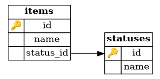

Title: Plectrum: Lookup tables to Rust enums
Author: Vineet Naik
Date: 2025-09-23
Tags: rust, opensource
Category: programming
Summary: An open source library to map lookup/reference tables in db with Rust enums in code
Status: published

Last year, I implemented
[Plectrum](https://github.com/naiquevin/plectrum){target="_blank"}, a
Rust crate that maps lookup tables (a.k.a. reference tables) in a
database to enum types in code. At the time I wasn't entirely sure if
such a library even needed to exist since it solves a very specific
problem. But it was the perfect excuse to get my <s>hands dirty</s>
brain fried implementing procedural macros in Rust. Probably for the
first time, I used generic type parameters in my own abstraction,
something I'd been side-stepping until that point. Eventually, I
published it on crates.io too.

So I saw it mostly as a learning exercise, until last week when I used
it in another project and it fit perfectly. That felt like a nice bit
of validation that the library does serve a real use case. The README
and examples in the repo only scratch the surface and the problem it
solves is tricky to grasp if you haven't run into it yourself. In this
post, I’ll walk through Plectrum’s use case in more detail and show
how it can help write robust and performant code when working with
lookup tables.

### Lookup tables

Lookup tables are perhaps more popularly known as _reference tables_
because there's a [Wikipedia
entry](https://en.wikipedia.org/wiki/Reference_table) for it. It says:

> In the context of database design a reference table is a table into
> which an enumerated set of possible values of a certain field data
> type is divested. It is also called a domain table because it
> represents the domain for the columns that reference it. For
> example, in a relational database model of a warehouse the entity
> 'Item' may have a field called 'status' with a predefined set of
> values such as 'sold', 'reserved', 'out of stock'. In a purely
> designed database these values would be divested into an extra
> entity or Reference Table called 'status' in order to achieve
> database normalisation.

These tables contain key-value pairs, usually a numeric identifier
mapped to a human readable name.

```sql
sqlite> .schema statuses
CREATE TABLE statuses (
    id integer primary key,
    name text unique
);
sqlite> select * from statuses;
1|sold
2|reserved
3|out_of_stock
sqlite>
```

Typically, the names are tightly coupled with application code. For
example, you might have specific branches for handling each of the
possible item statuses in code. Hence such tables are essentially
_static_ i.e. insertions are performed only by developers and are
usually accompanied by significant changes in code.

In Rust, the values are best represented using enums.

```rust
enum Status {
    Sold,
    Reserved,
    OutOfStock,
}
```

But why store them in the database at all? The answer is
[normalization](https://en.wikipedia.org/wiki/Database_normalization){target="_blank"}. Other
tables include `status_id` columns that reference the `id` of the
reference table via a foreign key constraint. This provides
database-level guarantees, such as ensuring that an item with an
invalid status can never be inserted.



### Problem

Such schema design introduces an interesting problem in the
application layer. A query against the `items` table will return only
the `status_id`, and we'd ideally want to deserialize it into the
corresponding variant of the `Status` enum. There is no way to get the
enum from the status id without either:

1. hard coding the status id as well, a classic _footgun_

2. looking up in the db, which means every such query has to join
   against the `statuses` table

```sql
select
    i.*
from
    items i
    inner join statuses s on (i.status_id = s.id)
where
    s.name = 'out_of_stock';
```

Similarly, when inserting an item, we'd need to use a sub-query to get
the status id from name:

```sql
insert into
    items (name, status_id)
values
    (
        'refrigerator',
        (
            select
                id
            from
                statuses
            where
                name = 'reserved'
        )
    );
```

This is slightly better than hard coding status ids. We're at least
consistently using only human readable status names everywhere in
code. But that means status names are now hard coded in the
application layer, which defeats the purpose of normalization. If
there's a need to change any of the status names in future, we have to
remember to find-replace all hard coded strings in the
codebase. Simply relying on the RDBMS's guarantee of referential
integrity is not sufficient.

Ideally, we should always be using the `Status` enum in code, with the
provision to convert it to the correct status id and vice
versa. Because the lookup tables are _static_, we could fetch all rows
from the `statuses` table when the application starts and hold them in
memory for the lifetime of the process. Anytime the enum/name has to
be converted to id or vice versa, we use the mapping. There
are clear advantages of this approach:

1. No need for the table join. While the performance cost of joins in
   this context may not be significant, the SQL queries will certainly
   end up a lot simpler.

2. The mappings are in memory, so lookups are fast.

3. By using enums instead of hard coded strings, we're leveraging
   rust's type checker to catch errors at compile time.

### Solution

While it wouldn't take much code to implement the above behaviour, it
helps to have an abstraction that provides this functionality,
especially if there are multiple lookup tables. Well, that's what
plectrum is.

Before we can construct the mapping, we need to have the `Status` enum
implement methods in the
[plectrum::Enum](https://docs.rs/plectrum/latest/plectrum/trait.Enum.html){target="_blank"}
trait. Thanks to the `Plectrum` derive macro we don't have to do it
manually.

```rust
use plectrum::Plectrum;

#[derive(Plectrum)]
#[plectrum(rename_all = "snake_case")]
enum Status {
    Sold,
    Reserved,
    OutOfStock,
}
```

The macro supports a `plectrum` attribute with a `rename_all`
argument. It controls how enum variant names are translated from code
to data. For e.g. an enum variant in _UpperCamelCase_ (`OutOfStock`)
can be mapped to its database value in _snake_case_
(`out_of_stock`). If you’ve used the
[serde](https://serde.rs/){target="_blank"} crate before, this pattern
will feel familiar. To use the derive macro, make sure to add plectrum
as a dependency with the `derive` feature enabled.

To construct the mapping that will be held in memory, plectrum
provides a
[Mapping](https://docs.rs/plectrum/latest/plectrum/struct.Mapping.html){target="_blank"}
struct with the following definition:

```rust
impl<K: Hash + Eq + Copy, E: Enum> Mapping<K, E>
```

The type parameter `K` corresponds to the status id, which will
typically be a numeric value. And `E` corresponds to our enum that
implements the `plectrum::Enum` trait.

To initialize the mapping, we call the `Mapping::load` method which
has the following signature:

```rust
pub async fn load<S: DataSource<Id = K>>(source: &S) -> Result<Self, Error>
```

This method sets up bi-directional mapping between the status id and
its corresponding name. But it needs to know how and from where to
load the data. For that we've to pass it a _source_ that implements
the
[plectrum::DataSource](https://docs.rs/plectrum/latest/plectrum/trait.DataSource.html){target="_blank"}
trait, which is the final piece of the puzzle.

Continuing with our sqlite example, let's use
[sqlx](https://github.com/launchbadge/sqlx){target="_blank"} to load
data from the db.

```rust
use sqlx::SqlitePool;

struct StatusModel<'a> {
    pool: &'a SqlitePool,
}

impl<'a> StatusModel<'a> {
    pub fn new(pool: &'a SqlitePool) -> Self {
        Self { pool }
    }
}

impl<'a> plectrum::DataSource for StatusModel<'a> {
    type Id = u32;

    async fn load(&self) -> Result<HashMap<u32, String>, plectrum::Error> {
        let q = "select id, name from statuses";
        let results: Vec<(u32, String)> = sqlx::query_as(q)
            .fetch_all(self.pool)
            .await
            .map_err(plectrum::Error::Sqlx)?;
        let mapping = results.into_iter().collect();
        Ok(mapping)
    }
}
```

With this code in place, we can initialize the mapping as follows:

```rust
let dbpool: SqlitePool = init_db_pool();
let model = StatusModel::new(dbpool);
let mapping = plectrum::Mapping::load(&model).await.unwrap();
```

And in the application code, 

```rust
mapping.by_id(1)                     // Some(Status::Sold)
mapping.by_id(4)                     // None
mapping.by_value("out_of_stock")     // Some(Status::OutOfStock)
Status::Reserved.id(&mapping)        // Some(2)
```

If the schema has multiple reference tables, it makes sense to define
a struct that holds all the mappings:

```rust
pub struct LookupTables {
    pub statuses: plectrum::Mapping<u32, Status>,
}

impl LookupTables {
    pub async fn load(pool: &SqlitePool) -> Result<Self, plectrum::Error> {
        let model = StatusModel::new(pool);
        Ok(Self {
            statuses: plectrum::Mapping::load(&model).await?
        })
    }
}
```

### Using plectrum with frameworks

In case you're using any framework, it will likely provide an elegant
way to manage application state. In
[Tauri](https://v2.tauri.app/){target="_blank"} for example:

```rust
tauri::Builder::default()
    .setup(|app| {
        // ...

        let lookup_tables = Arc::new(async_runtime::block_on(async {
            // Assuming dbpool is initialized and available in this block
            LookupTables::load(&dbpool).await
        })?);
        app.manage(lookup_tables);

        // ...
    })
    .run(tauri::generate_context())
    .unwrap();
```

Or in case of
[Axum](https://github.com/tokio-rs/axum){target="_blank"}:

```rust
#[derive(Clone)]
struct AppState {
    dbpool: SqlitePool,
    lookup_tables: Arc<LookupTables>,
}

let state = AppState {
    // Assuming dbpool is initialized
    dbpool: dbpool.clone(),
    lookup_tables: Arc::new(LookupTables::load(&dbpool).await),
};

// create a `Router` that holds our state
let app = Router::new()
    .route("/", get(handler))
    .with_state(state);

```

Now let's see how it helps with robustness.

### Inconsistencies between enum and lookup table

At the time of application setup, it's possible to have
inconsistencies between lookup table entries in the db and enum
variants. For example:

1. There could be entries in the table for which enum variants are not
   defined

2. There could enum variants for which entries don't exist in the
   lookup table

In such cases, the `Mapping::load` method would return
`plectrum::Error::NotDefinedInCode` and
`plectrum::Error::NotFoundInDb` errors respectively.

Because the mapping happens only once during process initialization,
it implies that if an entry is added to or removed from the lookup
table, the enum definition would also have to be modified accordingly
(followed by restarting the process). The above errors act as a safety
net to catch any inconsistencies eagerly i.e. the process will fail to
start, which in most cases is preferable to errors at run time.

So that's about all there is to plectrum. Using it in my current
project motivated me to revisit the code as a result of which I pushed
a few improvements. The new release
[0.2.0](https://crates.io/crates/plectrum/0.2.0){target="_blank"} is
cleaner and better aligned with Rust's best practices. Hope others
will find this crate useful.

<hr/>

If you've read this far, thank you! Just want to leave a note that I
am available for contract work (or a full-time position if there's
alignment) from November 2025, with a strong preference for projects
leveraging Rust and/or PostgreSQL. Here's my up-to-date
[resume](/files/VineetNaikResume.pdf).

