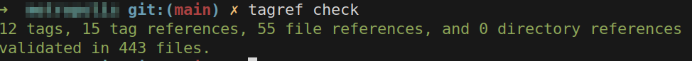

Title: tagref can now be used with org-mode files
Author: Vineet Naik
Date: 2026-05-22
Tags: tagref, org-mode, opensource
Category: programming
Summary: About the tagref tool and my recent patch that makes it play nicely with org-mode files
Status: published



I recently contributed a patch to
[tagref](https://github.com/stepchowfun/tagref) that makes it play
nicely with Emacs org-mode files. The
[PR](https://github.com/stepchowfun/tagref/pull/273) has already been
merged and the feature is available since version 1.12.0.

In this post I want to explain what the PR improves and show how
tagref can be used in a project where internal/developer documentation
in written in org-mode. But first, let me briefly introduce tagref.

### What is tagref?

tagref is a command-line tool that helps manage "tags" and
"references" in a project. The idea is based on cross-referencing code
and documentation, inspired by the GHC *notes* system described in the
[Glasgow Haskell Compiler](http://www.aosabook.org/en/ghc.html) (§5.6)
chapter of the [AOSA book](https://aosabook.org).

In short, you can annotate code (or text in any file) with a *tag*
inside a comment:

```typescript

// [tag:rare-edge-case]
function handleRareEdgeCase() {
  ...
  ...
}
```

The tag can then be referenced elsewhere in the repository, such as a
doc that explains why the particular edge case might happen or what
the developer specifically needs to consider before changing that
code.

```md
### A rare edge case

[ref:rare-edge-case]
```

The same tag can be referenced in other files too. This way, different
parts of code and docs become interconnected. When a developer comes
across a ref they can quickly look up the tag, the associated notes as
well as other references to get a holistic understanding of the code
they are about to touch.

The tags and refs can be managed through a command-line interface
provided by tagref to,

- list all tags and refs
- check that the referenced tags actually exist and that there are
  no duplicate tags
- list all unused tags

The `check` command can be run in a pre-commit hook or CI
pipeline. This helps catch drift between code and docs, which is quite
likely when internal documentation (architectural decision records,
how-to guides, troubleshooting guides, checklists etc.) lives
separately from the code.

Inside a monorepo (such as [captrice](https://www.captrice.io)'s
codebase), this kind of documentation and note-taking convention,
along with the tagref tool, provides a decent system for annotating a
source of truth (usually code, but sometimes a doc), and pointing back
to it from other places in the repo. Markdown is probably the more
popular format for such docs but I prefer to use org-mode, at least in
my personal projects.

### What did my PR solve?

Besides user defined tags, tagref also supports refs pointing to files
and directories in the repository.

```typescript
// Refer: [file:dev-docs/weekly-stats.org]
export async function computeWeeklyStats(
  db: IdbModel,
  now?: Date
): Promise<WeeklyStats> {
 ...
}
```

The above example is taken from captrice's codebase. The
`dev-docs/weekly-stats.org` file documents optimizations and other
decisions about calculating and displaying weekly stats on the home
page.

The default *sigil* for file references is `file:` which happens to be
exactly the same as the *bracket-link* syntax that org-mode uses for
internal links. In org-mode, an internal link to another document can
be added as,

```org
* User home page components
  - [[file:./weekly-stats.org][Weekly stats]]
```

However, org-mode expects the file path to be relative to the current
file, whereas tagref (prior to version 1.12.0) considers all paths to
be relative to the working directory. I'd been working around this by
specifying `doc:` as the custom file sigil, but there were
limitations:

1. The `--file-sigil` option had to be explicitly specified every time
   tagref was run, otherwise the `check` would fail.

2. Despite having cross referencing between org files, tagref's check
   command couldn't be leveraged to catch broken links.

[PR #273](https://github.com/stepchowfun/tagref/pull/273) addresses
this by adding optional support for relative paths in file and
directory references. If the path is prefixed with special path
components such as `./`, `../` and so on, it's considered relative to
the file that contains the reference. Otherwise it's considered
relative to the working directory (same as the original behavior,
which makes the change fully backward compatible).

For example,

- `[file:./weekly-stats.org]` will be considered relative to the file
  in which it exists


- `[file:weekly-stats.org]` will be considered relative to the working
directory

### Preventing Emacs from normalizing relative paths

When editing org-mode files in Emacs, one almost never types out
bracket links by hand. Instead, `C-c C-l` or `M-x org-insert-link` is
used to insert a link interactively. But then the file path gets
normalized i.e. even if `./doc.org` is explicitly specified, it gets
replaced with `doc.org` which is shorter and simpler representation of
the same path.

This would cause tagref to treat it relative to the working
directory. To prevent this, we can tell emacs to skip normalization of
relative file paths. However, the solution feels inelegant as
we're effectively patching a natively compiled core function
`file-relative-name` in emacs, and not just an org-mode specific
function. Considering this, we can conservatively define the
[advice](https://www.gnu.org/software/emacs/manual/html_node/elisp/Advising-Functions.html)
such that it affects only those org buffers where the
`org-link-file-path-type` variable is set to `'relative` as a local
binding.

```elisp
  ;; @HACK: When file-based link is added in an org file using the
  ;; bracket link syntax, we want a relative path in the same
  ;; directory to contain a `./' prefix if `org-link-file-path-type'
  ;; is set to `'relative'. This makes it work well with the `tagref'
  ;; tool. Without this advice, the path gets normalized
  ;; e.g. `./doc.md' becomes `doc.md' even when the former is
  ;; explicitly specified.
  ;;
  ;; This feels a bit hacky though because `file-relative-name' is a
  ;; core emacs function that we're patching and not an org-specific
  ;; one. Hence we're checking multiple pre-conditions to ensure that
  ;; the behavior takes effect only when required and can also be
  ;; opted out of.
  (advice-add 'file-relative-name
              :filter-return
              (lambda (path)
                (if (and (derived-mode-p 'org-mode)
                         ;; Only if set locally (e.g., .dir-locals.el)
                         (local-variable-p 'org-link-file-path-type)
                         (eq org-link-file-path-type 'relative)
                         (not (file-name-absolute-p path))
                         (not (string-prefix-p "." path)))
                    (concat "./" path)
                  path)))
```

To opt into this behavior, you need to override
`org-link-file-path-type` locally for all files in the project. This
can be conveniently done through a `.dir-locals.el` file at the
repository root.

```elisp
(
 (org-mode . ((org-link-file-path-type . relative)))
)
```

With these two pieces in place, tagref works seamlessly with org-mode
files.
